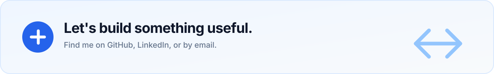

<!--
PROFILE CUSTOMIZATION
Replace every [PLACEHOLDER] in this file with your personal information.
Update the profile header in assets/profile-header.svg.
Keep repository links accurate and remove any project or writing section you do not want to show.
-->

  

  

    
    
    
  

  

    <a href="#featured-projects">Projects</a> ·
    <a href="#skills--tools">Skills</a> ·
    <a href="#github-activity">Activity</a> ·
    <a href="#contact">Contact</a>
  

## Hi, I'm Ibro 👋

**[PLACEHOLDER: One sentence describing who you are and the kind of problems you enjoy solving.]**

I care about building software that is **clear, useful, and maintainable**. I enjoy turning ideas into working products, learning from unfamiliar challenges, and improving one project at a time.

- 🔭 Currently working on **[PLACEHOLDER: current project or learning goal]**
- 🌱 Currently learning **[PLACEHOLDER: technology or concept]**
- 👯 Looking to collaborate on **[PLACEHOLDER: project type or area of interest]**
- 💬 Ask me about **[PLACEHOLDER: topic you know well or enjoy discussing]**
- ⚡ Fun fact: **[PLACEHOLDER: a fun fact]**

## About & Expertise

| Focus | What I do |
| :---: | :--- |
| 💡 **Product thinking** | Translating a problem into a focused, useful, and understandable solution. |
| 🧩 **Software engineering** | Designing maintainable features and turning requirements into reliable code. |
| 🚀 **Continuous learning** | Exploring new tools, questioning assumptions, and learning by building. |

**[PLACEHOLDER: Add two or three sentences about your background, experience, and what you want to be known for.]**

## Featured Projects

### 1. [Project One]

A short, specific description of the problem this project solves and its most important feature.

- **Stack:** `[PLACEHOLDER: technology 1]`, `[PLACEHOLDER: technology 2]`
- **Role:** `[PLACEHOLDER: your contribution or responsibility]`
- **[View repository →](https://github.com/ibro-3/[PLACEHOLDER])** · **[Live demo →]([PLACEHOLDER])**

### 2. [Project Two]

A short, specific description of the project and why it is useful or interesting.

- **Stack:** `[PLACEHOLDER: technology 1]`, `[PLACEHOLDER: technology 2]`
- **Role:** `[PLACEHOLDER: your contribution or responsibility]`
- **[View repository →](https://github.com/ibro-3/[PLACEHOLDER])** · **[Live demo →]([PLACEHOLDER])**

### 3. [Project Three]

A short, specific description of what you learned or built with this project.

- **Stack:** `[PLACEHOLDER: technology 1]`, `[PLACEHOLDER: technology 2]`
- **Role:** `[PLACEHOLDER: your contribution or responsibility]`
- **[View repository →](https://github.com/ibro-3/[PLACEHOLDER])** · **[Live demo →]([PLACEHOLDER])`

## Skills & Tools

### Languages

    

### Frameworks & Platforms

    

> Replace or remove these badges so the list reflects the technologies you actually use.

### Currently Exploring

- **[PLACEHOLDER: Technology or concept]**
- **[PLACEHOLDER: Technology or concept]**
- **[PLACEHOLDER: Technology or concept]**

## GitHub Activity

  
    
  

 

  
    
  

## Writing & Interests

### Latest Notes

- **[PLACEHOLDER: Article title]** — A short summary of the idea or lesson. · `[Read →]([PLACEHOLDER])`
- **[PLACEHOLDER: Article title]** — A short summary of the idea or lesson. · `[Read →]([PLACEHOLDER])`
- **[PLACEHOLDER: Article title]** — A short summary of the idea or lesson. · `[Read →]([PLACEHOLDER])`

### Things I'm Into

- **[PLACEHOLDER: Interest or topic]**
- **[PLACEHOLDER: Interest or topic]**
- **[PLACEHOLDER: Interest or topic]**

## Contact

  
  
  
  

Open to thoughtful conversations, collaboration, and ambitious ideas.

---

  Built with curiosity and a preference for clear, maintainable code.

