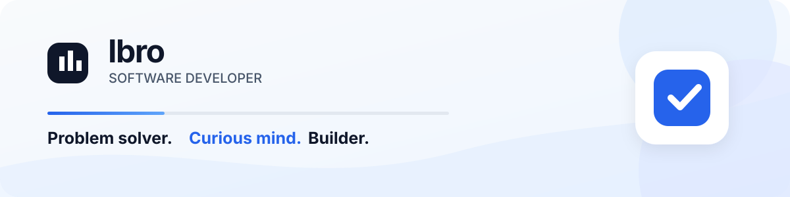

<!--
Keep this profile focused: one introduction, a clear stack, lightweight activity,
and direct ways to get in touch. Replace the placeholders as your details evolve.
-->

  

  

    
    
    
  

## Hi, I'm Ibro 👋

I build software across web and mobile, with an interest in **clear interfaces and practical solutions**.

- 🔭 Currently working on **[PLACEHOLDER]**
- 🌱 Currently learning **[PLACEHOLDER]**
- 💬 Ask me about **[PLACEHOLDER]**

## Stack

## GitHub Activity

  

## Connect

  
  
  

Open to thoughtful conversations, collaboration, and ambitious ideas.

